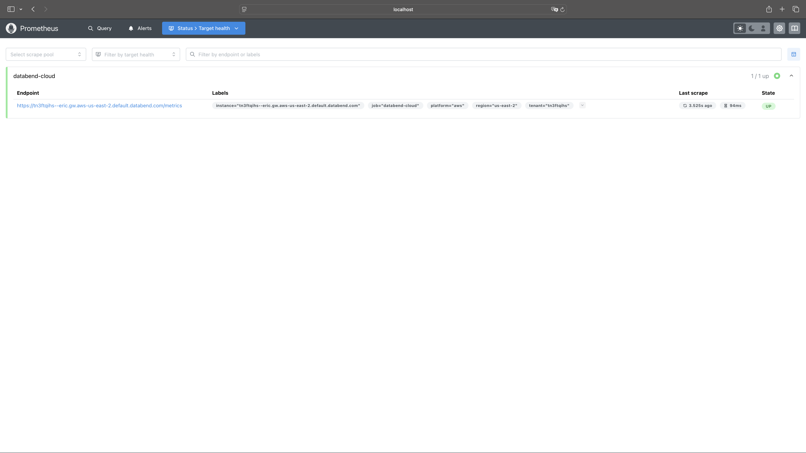
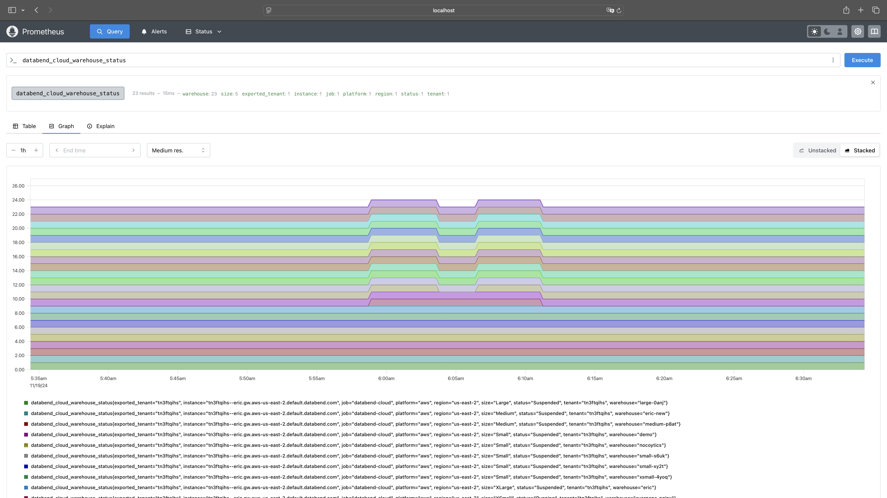

import StepsWrap from '@site/src/components/StepsWrap';
import StepContent from '@site/src/components/Steps/step-content';

[Prometheus](https://prometheus.io/) 提供了一个强大的实时监控解决方案，使您能够有效跟踪关键指标并维护系统稳定性。本主题将指导您完成将 Prometheus 与 Databend Cloud 集成的步骤，并概述可用的指标。

:::note
使用 Prometheus 跟踪指标仅适用于 Databend Cloud 的商业和专属计划用户。
:::

## 与 Prometheus 集成

按照以下步骤使用 Docker 设置 Prometheus 实例并将其与 Databend Cloud 集成：

<StepsWrap>
<StepContent number="1">

### 前提条件

- 要开始跟踪指标，请确保为您的 Databend Cloud 租户启用了指标。要启用此功能，请在 Databend Cloud 中提交支持工单，导航至 **Support** > **Create New Ticket**，并请求为您的租户激活指标。

- 此过程解释了如何使用 Docker 设置 Prometheus 实例。在继续之前，请确保您的机器上已安装 Docker Engine。

</StepContent>
<StepContent number="2">

### 准备 SQL 用户

在 Databend Cloud 中为 Prometheus 创建一个专用的 SQL 用户以访问指标。例如，您可以使用以下 SQL 语句创建一个名为 `metrics` 且密码为 `metrics_password` 的 SQL 用户：

```sql
CREATE USER metrics IDENTIFIED BY 'metrics_password';
```

</StepContent>
<StepContent number="3">

### 使用 Docker 启动 Prometheus

1. 在您的本地机器上，创建一个名为 **prometheus.yml** 的文件，以配置 Prometheus 从 Databend Cloud 抓取指标。使用以下模板：

```yaml title='prometheus.yml'
scrape_configs:
  - job_name: databend-cloud
    scheme: https
    metrics_path: /metrics
    basic_auth:
      username: <USERNAME>
      password: <PASSWORD>
    scrape_interval: 10s
    scrape_timeout: 3s
    static_configs:
      - targets:
          - <TENANT_ENDPOINT>
        labels: # 可选
          tenant: <TENANT_ID>
          platform: <PLATFORM>
          region: <REGION>
```

| 占位符              | 描述                            | 示例                                              |
| ------------------- | ------------------------------- | ------------------------------------------------- |
| `<USERNAME>`        | SQL 用户的用户名。              | `metrics`                                         |
| `<PASSWORD>`        | SQL 用户的密码。                | `metrics_password`                                |
| `<TENANT_ENDPOINT>` | Databend Cloud 租户的端点 URL。 | `tnxxxxxxx.gw.aws-us-east-2.default.databend.com` |
| `<TENANT_ID>`       | 租户的唯一标识符。              | `tnxxxxxxx`                                       |
| `<PLATFORM>`        | 托管租户的云平台。              | `aws`                                             |
| `<REGION>`          | 租户所在的区域。                | `us-east-2`                                       |

2. 使用以下命令启动 Prometheus（将 `</path/to/prometheus.yml>` 替换为您的 **prometheus.yml** 文件的完整路径）：

```bash
docker run -d \
  --name prometheus \
  -p 9090:9090 \
  -v </path/to/prometheus.yml>:/etc/prometheus/prometheus.yml \
  prom/prometheus
```

3. 在浏览器中打开 Prometheus，网址为 `http://localhost:9090`，导航到 **Status** > **Target health**，并确认 `databend-cloud` 目标的状态为 `UP`。



</StepContent>
</StepsWrap>

您已准备就绪！现在可以直接从 Prometheus 查询您的租户指标。例如，尝试查询 `databend_cloud_warehouse_status`：



## 可用指标列表

请注意，所有指标都以 `databend_cloud_` 为前缀。

:::note
这些指标处于 alpha 状态，可能会随时间变化。我们建议您密切监控这些指标，并相应调整您的监控设置。
:::

### 查询指标

以下是 Databend Cloud 中可用的查询指标列表：

| 名称                 | 类型    | 标签             | 描述                         |
| -------------------- | ------- | ---------------- | ---------------------------- |
| query_count          | Counter | tenant,warehouse | 客户端发起的查询次数         |
| query_errors         | Counter | tenant,warehouse | 客户端发起的查询错误次数     |
| query_request_bytes  | Counter | tenant,warehouse | 客户端查询请求的字节数       |
| query_response_bytes | Counter | tenant,warehouse | 发送给客户端的查询响应字节数 |

### 存储指标

以下是 Databend Cloud 中可用的存储指标列表：

| 名称                          | 类型  | 标签   | 描述                           |
| ----------------------------- | ----- | ------ | ------------------------------ |
| storage_total_size            | Guage | tenant | 后端对象存储的总大小           |
| storage_staged_size           | Guage | tenant | 后端对象存储中暂存文件的总大小 |
| storage_table_compressed_size | Guage | tenant | 当前表的后端对象存储的总大小   |
| storage_non_current_size      | Guage | tenant | 后端存储中非当前对象的总大小   |

### 计算集群指标

以下是 Databend Cloud 中可用的计算集群指标列表：

| 名称                             | 类型    | 标签                         | 描述                               |
| -------------------------------- | ------- | ---------------------------- | ---------------------------------- |
| warehouse_status                 | Guage   | tenant,warehouse,size,status | 计算集群状态的标志（挂起、运行等） |
| warehouse_connections            | Guage   | tenant,warehouse             | 当前的会话数                       |
| warehouse_queries_queued         | Guage   | tenant,warehouse             | 当前等待队列中的查询数             |
| warehouse_queries_running        | Guage   | tenant,warehouse             | 当前运行的查询数                   |
| warehouse_queries_start_total    | Counter | tenant,warehouse             | 启动的查询总数                     |
| warehouse_queries_failed_total   | Counter | tenant,warehouse             | 失败的查询总数                     |
| warehouse_queries_success_total  | Counter | tenant,warehouse             | 成功的查询总数                     |
| warehouse_storage_requests_total | Counter | tenant,warehouse,scheme,op   | 后端存储的请求次数                 |
| warehouse_storage_requests_bytes | Counter | tenant,warehouse,scheme,op   | 后端存储的请求字节数               |
| warehouse_data_scan_rows         | Counter | tenant,warehouse             | 从后端存储扫描的数据行数           |
| warehouse_data_write_rows        | Counter | tenant,warehouse             | 写入后端存储的数据行数             |

### 任务指标

以下是 Databend Cloud 中可用的任务指标列表：

| 名称                            | 类型    | 标签            | 描述                   |
| ------------------------------- | ------- | --------------- | ---------------------- |
| task_scheduled_total            | Counter | tenant,task     | 计划的任务总数         |
| task_query_requests_total       | Counter | tenant,task     | 任务的查询请求总数     |
| task_run_skipped_total          | Counter | tenant,task     | 跳过的任务运行总数     |
| task_accessor_requests_total    | Counter | tenant,function | 任务的访问器请求总数   |
| task_notification_success_total | Counter | tenant          | 成功的任务通知总数     |
| task_notification_errors_total  | Counter | tenant          | 任务通知错误总数       |
| task_running_duration_seconds   | Counter | tenant,task     | 任务运行持续时间（秒） |
| task_running                    | Counter | tenant,task     | 正在运行的任务         |
| task_scheduled_timestamp        | Counter | tenant,task     | 计划任务的时间戳       |
